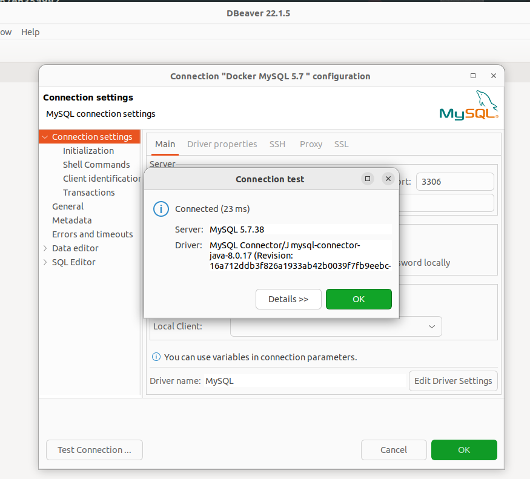
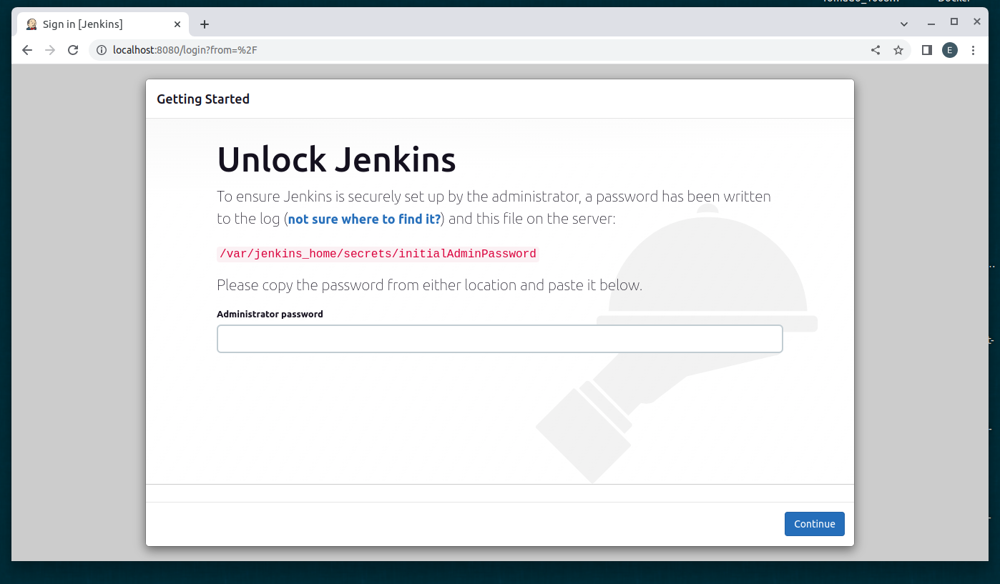
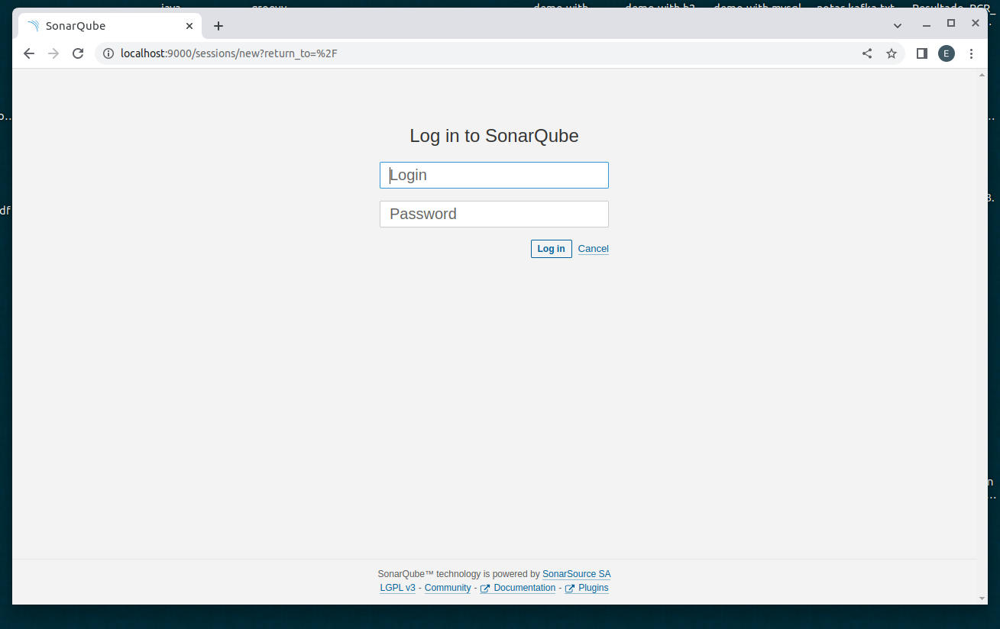

DOCKER EXAMPLES
--------------------------------------------------------------

**Running MySQL 5.7**


Running the container in detached mode (-d option). 

The root password is defined as an environment variable (-e option):

```

docker run -p 3306:3306 -e MYSQL_ROOT_PASSWORD=password -d mysql:5.7

```

Defining a volume, so your databases and data is not lost when the container is terminated:

```

docker run -p 3306:3306 -v /path/volume:/var/lib/mysql -e MYSQL_ROOT_PASSWORD=password -d mysql:5.7

```

Connecting to MySQL from DBeaver:



--------------------------------------------------------------

**Running Jenkins**


Running the container in detached mode (-d option):

```

docker run -p 8080:8080 -p 50000:50000 -d jenkins/jenkins:lts-jdk11

```

Defining a volume, so your configurations are not lost when the container is terminated:

```

docker run -p 8080:8080 -p 50000:50000 -v jenkins_home:/var/jenkins_home -d jenkins/jenkins:lts-jdk11

```

Jenkins running in port 8080:



--------------------------------------------------------------

**Running Sonarqube**


Running in detached mode (-d option):

```

docker run -d -p 9000:9000 sonarqube

```

Defining a volume:

```

docker run -d -v /local/path:/opt/sonarqube sonarqube

```

Sonarqube running in port 9000:



--------------------------------------------------------------